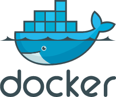

# docker 常用命令



> 以下程序都是基于CentOS版本。

* [命令](/cmd/docker-cmd?id=命令)

##### 命令

``` shell
# 进入docker容器内部
docker exec -it xxx /bin/bash 

# 同步docker容器与宿主机时间
docker cp /etc/localtime 8ea91b2f6274:/etc/

# 删除镜像为none的镜像
docker rmi $(docker images | grep "none" | awk '{print $3}')

# 查看指定时间后的日志，只显示最后100行
docker logs -f -t --since="2018-02-08" --tail=100 CONTAINER_ID

# 查看指定时间范围日志
docker logs -f --since='2021-02-18T03:00:00' --until='2021-02-18T03:10:00' CONTAINER_ID

# 查询指定日志，特定字符串
cat logs/way_pay/order-record/order-record-logs-2019-10-15.0.log |grep '7f2f9177f653a09d'

```
