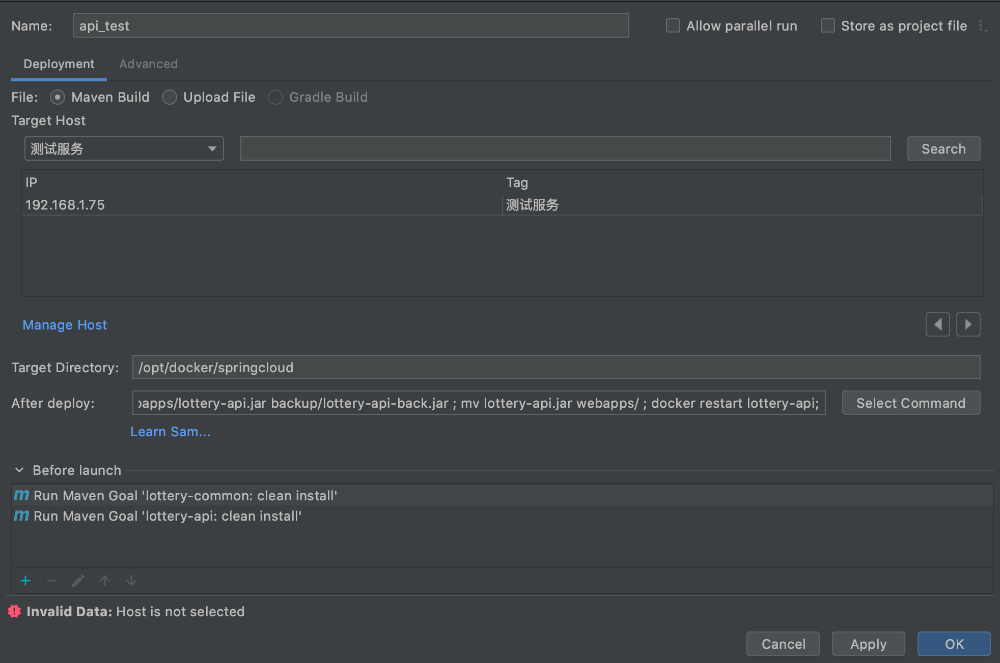

# docker-compose + idea 如何一键部署


> 以下程序都是基于CentOS版本。

* [如何一键部署 Spring-boot 项目](/problem/docker-compose-deploy?id=如何一键部署-spring-boot-项目)
* [如何一键部署-tomcat-项目](/problem/docker-compose-deploy?id=如何一键部署-tomcat-项目)

##### 如何一键部署 Spring-boot 项目

1. 安装idea插件 [Alibaba Cloud Toolkit](https://plugins.jetbrains.com/plugin/11386-alibaba-cloud-toolkit)。

2. 服务器配置并安装好[docker和docker-compose](/deploy/install)

3. 配置docker-compose

``` yaml
version: '3'
services:
  # api服务
  ant_api:
    image: ascdc/jdk8
    ports:
      - 8010:8010
    restart: 'always'
    container_name: ant_api
    environment:
      TZ: Asia/Shanghai
    volumes:
      - ./ant_api:/data/
    entrypoint: java -jar /data/webapps/ant_api.jar
```

4. 配置一键部署脚本，打开idea -> Deploy to Host

``` shell
rm -rf back/ant_api.jar ;
mv webapps/ant_api.jar backup/ant_api_back.jar ;
mv ant_api.jar webapps/ ;
docker restart ant_api;
```




##### 如何一键部署 tomcat 项目

1. 插件安装与docker等安装省略。

2. 配置docker-compose 

``` yaml
  tomcat_service:
    image: donglsheng/tomcat9_jdk8
    container_name: tomcat_service
    ports:
      - 8080:8080
    environment:
      TZ: Asia/Shanghai
    volumes:
      - /opt/deploy/webapps:/usr/local/soft/tomcat/webapps
      - /opt/deploy/conf:/usr/local/soft/tomcat/conf
      - /opt/deploy/bin/catalina.sh:/usr/local/soft/tomcat/bin/catalina.sh
    command: ["catalina.sh", "run"]
```

!> docker版tomcat，控制台乱码解决：<br><br>
    1. ` vi /tomcat/bin/catalina.sh ` <br>
    2. 添加如下代码：`export JAVA_OPTS='-Doracle.jdbc.timezoneAsRegion=false -Xms1024m -Xmx4096m -Dfile.encoding=UTF-8'`
