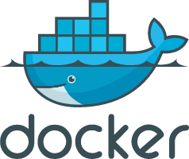

# Docker 限制容器日志大小



> 以下程序都是基于CentOS版本。

* [Docker限制容器日志大小](/problem/docker-compose-problem?id=_1-linux服务器因docker文件占满，导致无法启动问题。)

##### Docker限制容器日志大小


**一、查看 docker 中容器日志大小**

1.1 查看 docker 某个容器日志：

``` bash
docker logs -f 容器名称

```

1.2 在 linux 上容器日志一般存放在 `/var/lib/docker/containers/container_id` / 下面，以 json.log 结尾的文件 (业务日志) 很大：

``` bash
du -h --max-depth=1 * //可以查看当前目录下各文件、文件夹的大小。
du -h --max-depth=0 *  //可以只显示直接子目录文件及文件夹大小统计值。
du –sh //查看指定目录的总大小。
```

**二、清理 Docker 容器（治标）**

2.1 这里需要用 cat /dev/null > 进行清空，而不是 rm：

``` bash
cat /dev/null > /var/lib/docker/containers/容器id/容器id-json.log

```

**三、设置 Docker 容器日志大小（治本）**

3.1 设置一个容器服务的日志大小上限

通过配置容器 `docker-compose.yml `的 max-size 选项来实现:

``` yaml
nginx: 
  image: nginx:1.12.1 
  restart: always 
  logging: 
    driver: "json-file"
    options: 
      max-size: "5g"
```

3.2 全局设置

新建 `/etc/docker/daemon.json`，若有就不用新建了

``` bash
# vim /etc/docker/daemon.json
 
{
  "registry-mirrors": ["http://f613ce8f.m.daocloud.io"],
  "log-driver":"json-file",
  "log-opts": {"max-size":"500m", "max-file":"3"}
}
```

max-size=500m，意味着一个容器日志大小上限是 500M，

max-file=3，意味着一个容器有三个日志，分别是 id+.json、id+1.json、id+2.json

注：设置后只对新添加的容器有效。

重启 docker 守护进程

``` bash
systemctl daemon-reload
 
systemctl restart docker
```
